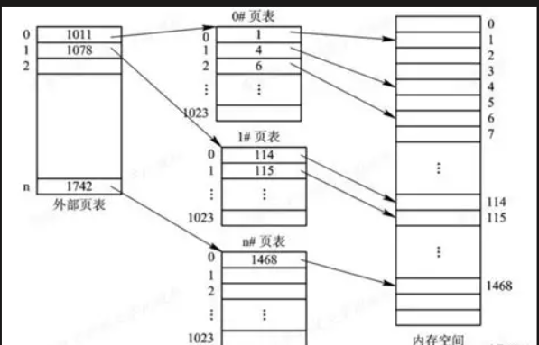

# 页表实现虚拟内存管理
本系统使用了的是三级页表，这里我们先创建了内核页表
### 页表的组成：
| 一级页表 | 二级页表 | 三级页表 | 物理地址偏移 |<>
| ------ | ------ | ------ | ------ | ------ |
|	 9   |    9	    | 9	      |     12     |<>

核心原理就是通过逐级索引找到对应的物理页：  
一级页表九位记录着二级页表的存放地址，二级页表存放着三级页表的地址，最后三级页表记录了物理页的位置，最后12位则是物理页内的偏移实现的方式为通过指针，数组的形式实现
```c
// shift a physical address to the right place for a PTE.
//将物理地址转化为表项的存储格式
#define PA2PTE(pa) ((((uint64)pa) >> 12) << 10)
//将也表存储格式转化成物理地址
#define PTE2PA(pte) (((pte) >> 10) << 12)

#define PTE_FLAGS(pte) ((pte) & 0x3FF)

#define PGSIZE 4096 // bytes per page
#define PGSHIFT 12 

#define PXMASK          0x1FF // 9 bits//保留相应位的掩码
#define PXSHIFT(level)  (PGSHIFT+(9*(level)))
#define PX(level, va) ((((uint64) (va)) >> PXSHIFT(level)) & PXMASK)
```
一个页的大小为4096字节，每一级的页表索引为九位，页表项的存储格式和物理有不同  
存储格式如下：

| 一级页表 | 二级页表 | 三级页表 | 标志位 |<>
| ------ | ------ | ------ | ------ | ------ |
|	 9   |    9	    | 9	      |     10     |<>

标志位的意思就是例如PA位，这是0是1告诉了我们这个页是否被映射；
而物理地址如下：
| 物理地址第一个九位 | 物理地址第二个9位 | 物理地址打三个9位 | 物理地址偏移 |<>
| ------ | ------ | ------ | ------ | ------ |
|	 9   |    9	    | 9	      |     12     |<>

所以前两个宏定义通过移位的方法来实现这些地址的相互转换


 
## 页表的创建
### 映射函数的实现
在这之前，我们先看一个寻找页表的函数
```c
int
mappages(pagetable_t pagetable, uint64 va, uint64 size, uint64 pa, int perm)
{
  uint64 a, last;
  pte_t *pte;

  if((va % PGSIZE) != 0)
    panic("mappages: va not aligned");

  if((size % PGSIZE) != 0)
    panic("mappages: size not aligned");

  if(size == 0)
    panic("mappages: size");
  
  a = va;
  last = va + size - PGSIZE;
  for(;;){
    if((pte = walk(pagetable, a, 1)) == 0)
      return -1;
    if(*pte & PTE_V)
      panic("mappages: remap");
    *pte = PA2PTE(pa) | perm | PTE_V;
    if(a == last)
      break;
    a += PGSIZE;
    pa += PGSIZE;
  }
  return 0;
}
```

开头先检查传入参数是否合法，这里先介绍一下传入的参数，第一个参数pagetable为页表根，第二个参数va为要指定映射的虚拟地址的起始地址，第三个参数size为映射大小，第四个参数pa指定映射的起始物理地址，第五个参数perm为指定该页的权限例如可否读写等；  
接下来在建立映射之前先检查当前的指定的虚拟地址是否已经有映射，通过walk函数查找，并检查PTE_V位来看是否被映射，接下来在没有映射的前提下建立映射：
```c
*pte = PA2PTE(pa) | perm | PTE_V;
```
接下来就是一些退出循环条件了，然后就完成了页的映射，接着就使用kvmmap函数进行进一步的封装  
### 接口在内核页表中的映射
```c
 // Make a direct-map page table for the kernel
 pagetable_t
 kvmmake(void)
 {
    pagetable_t kpgtbl;

    kpgtbl = (pagetable_t) kalloc();
    memset(kpgtbl, 0, PGSIZE);

    // uart registers
    kvmmap(kpgtbl, UART0, UART0, PGSIZE, PTE_R | PTE_W); 

    // virtio mmio disk interface
    kvmmap(kpgtbl,VIRTIO0, VIRTIO0, PGSIZE, PTE_R | PTE_W);

    // PLIC 
    kvmmap(kpgtbl,PLIC,PLIC,0x4000000, PTE_R | PTE_W);

    // map kernel text executable and read-only.
    kvmmap(kpgtbl, KERNBASE, KERNBASE, (uint64)etext-KERNBASE, PTE_R | PTE_X);

    // map kernel data and the physical RAM we'll make use of.
    kvmmap(kpgtbl, (uint64)etext, (uint64)etext, PHYSTOP-(uint64)etext, PTE_R | PTE_W);
    
    // allocate and map a kernel stack for process.
   proc_mapstacks(kpgtbl);

    return kpgtbl;
 }
```
这里先创建了内核页表，先对端口地址以及寄存器在内核页表中做映射（也就是填表），这里采用的方法是一一对应的线性映射，最后一个函数对所有的进程初始化一个内核栈，接着返回做好初始化的内核页表


