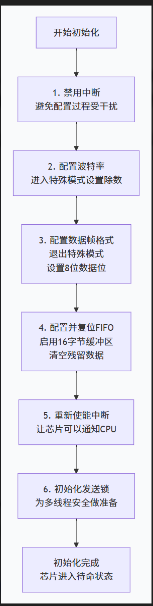
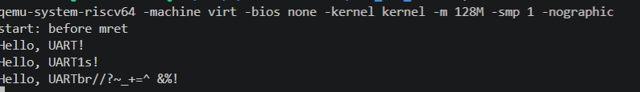

# UART串口输出字符
#### 开始之前需要了解一下UART串口通信：
UART为异步串行通信，在两个MCU通信之前需要知道双方的1.波特率 2.数据长度 3.开始位和停止位  
波特率也就是MCU的采样节奏


为了方便后续调试，这里先初步实现uart串口输出字符串，为此这里先对uart串口进行初始化配置


#### 这里的初始化操作就是配置波特率为38.4kbps，先设置寄存器的低八位和高八位分别为0x03和0x00，接着就是设置数据位宽为八位，然后清空FIFO并启用16字节缓冲区清空残留数据，接着就是一些中断的开与关
<br>

```c
void 
uartinit(void)
{
    //disable interrupts.在配置芯片前，首先关闭所有UART中断。这是为了防止在配置过程中，寄存器状态不稳定而触发意外中断，确保初始化过程干净、不受干扰。
    WriteReg(IER, 0x00);

    // special mode to set baud rate.向线路控制寄存器写入 LCR_BAUD_LATCH (即 1<<7)。这会将 LCR 的 DLAB 位设为 1。此时，地址 0 和 1 的寄存器被重新映射，不再是 RHR/THR 和 IER，而是变成了波特率除数锁存器的低字节 (DLL) 和高字节 (DLM)
    WriteReg(LCR, LCR_BAUD_LATCH);

    // LSB for baud rate of 38.4K.向映射后的地址 0（即DLL）写入 0x03，作为除数的低字节。
    WriteReg(0, 0x03);

    // MSB for baud rate of 38.4K.向映射后的地址 1（即DLM）写入 0x00，作为除数的高字节。
    WriteReg(1, 0x00);

    //leave set-baud mode,将 DLAB 位清 0，让地址 0 和 1 恢复为 RHR/THR 和 IER 的正常映射
    //and set word length to 8 bits, no parity设置数据位为 8位，并配置为无校验位、1位停止位（这是 LCR_EIGHT_BITS 最常用的默认行为）
    WriteReg(LCR, LCR_EIGHT_BITS);

    //reset and enable FIFOs.FCR_FIFO_ENABLE (1<<0): 启用16字节的发送和接收FIFO
    //同时清空发送和接收FIFO的内容，确保从一个干净的状态开始
    WriteReg(FCR, FCR_FIFO_ENABLE | FCR_FIFO_CLEAR);

    //enable reansmit and receive interrupts.在芯片配置完成后，重新使能发送和接收中断。此后，当UART收到数据或发送缓冲区为空时，就会向CPU发送中断信号
    WriteReg(IER, IER_TX_ENABLE | IER_RX_ENABLE);

    initlock(&tx_lock, "uart");
}
```
本次使用的是型号为 16550 UART型号的芯片，下面稍微解释一下寄存器的作用：
### 数据收发
#### RHR：只读，接收保持寄存器，内存放UART从外部收到的一字节数据。CPU通过读取这个地址就能获得数据  
#### THR：只写，发送保持寄存器，CPU把要发送的字节数据写入这个地址，UART芯片会自动把它发送出去
### 核心控制与状态
#### IER 中断使能寄存器：控制UART在什么事件下出发中断控制cpu  
#### FCR FIFO控制寄存器，控制芯片内部FIFO（先进先出缓冲区的行为）  
#### ISR 中断状态寄存器，CPU都这个地址时会返回当前的中断状态，用于判断是那种事件触发了中断  
#### LCR 线路控制寄存器，配置数据帧格式和特殊模式
#### LSR 线路状态寄存器 反应UART当前的工作状态，CPU通常通过轮询或结合中断来检查它  

<br><br>

```c
void
uartwrite(char buf[], int n)
{
    acquire(&tx_lock);

    int i = 0;
    while(i < n){
        // while(tx_busy != 0){
        //     // wait for a UART transmit-complete interrupt
        //     // to set tx_busy to 0.
        //     sleep(&tx_chan, &tx_lock);
        // }

        WriteReg(THR, buf[i]);
        i += 1;
        tx_busy = 1;
    }
    release(&tx_lock);
}
```
这里打印字符就是向THR寄存器里写需要输出的字符，接着由现实设备将字符显示在屏幕上

这里写了一个测试用例如下：
```c
void 
main()
{
    

        uartinit();
        char msg[] = "Hello, UART!\n";
        char msg1[] = "Hello, UART1s!\n";
        char msg2[] = "Hello, UARTbr//?~_+=^ &%!\n";
        uartwrite(msg, sizeof(msg)-1);
        // kinit();
        
        uartwrite(msg1, sizeof(msg1)-1);
        // kvminit();
        
        
        uartwrite(msg2, sizeof(msg2)-1);

    
}
```

运行结果如下：
